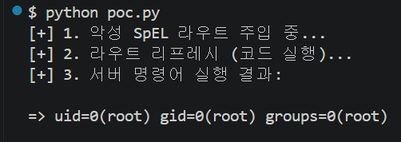

# CVE-2022-22947: Spring Cloud Gateway RCE

## 1. 취약점 요약
- 영향: Spring Cloud Gateway의 Actuator 엔드포인트가 활성화된 환경에서, 조작된 SpEL(Spring Expression Language) 표현식을 주입하여 서버 권한으로 임의의 원격 코드를 실행(RCE)할 수 있습니다.

## 2. 환경 구성
- 공식 `maven:3.8-eclipse-temurin-11` 및 `eclipse-temurin:11-jre` 이미지를 사용한 멀티 스테이지 빌드로 구성되었습니다.
- 취약한 버전(3.1.0)의 라이브러리를 `pom.xml`에 명시했습니다.

## 3. 취약 조건
- Spring Cloud Gateway 3.1.0 
- `application.yml`에서 `management.endpoint.gateway.enabled: true` 설정으로 Actuator Gateway 엔드포인트가 노출된 상태.
- 프레임워크 내부의 SpEL 입력값 검증 누락으로 인해 발생하는 코드 레벨의 취약점입니다.

## 4. 재현 절차
1. 터미널에서 환경을 빌드하고 백그라운드에서 실행합니다.
bash
   docker compose up --build -d

2. Spring Boot 애플리케이션이 완전히 구동될 때까지 약 15~20초 대기합니다.
3. PoC 스크립트 실행에 필요한 파이썬 라이브러리를 설치합니다. 
bash
   pip install requests

4. `poc.py`를 실행하여 원격 코드 실행(`id` 명령어)을 확인합니다.
bash
   python poc.py

## 5. PoC 코드 및 실행 결과
동봉된 `poc.py` 스크립트를 통해 악성 라우터를 추가하고 갱신하는 과정에서 주입한 `id` 명령어가 실행되었습니다.

## 6. 대응 방안
- 패치 적용: Spring Cloud Gateway 버전을 취약점이 해결된 3.1.1 이상으로 업데이트합니다.
- 엔드포인트 통제: 외부에 노출할 필요가 없는 Actuator 엔드포인트는 비활성화하거나, Spring Security 등을 도입하여 인가된 관리자만 접근할 수 있도록 네트워크 및 애플리케이션 레벨의 접근 제어를 강화해야 합니다.